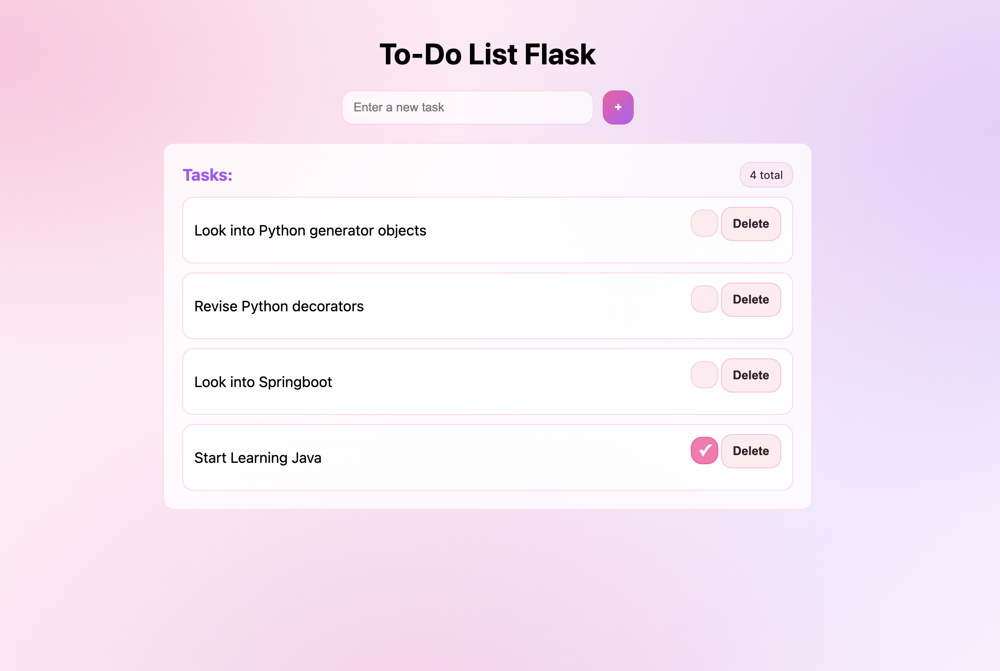

# 💖 Pink To-Do List Web App

I built this project to create a simple but visually cute and satisfying way to manage daily tasks. I wanted something more fun than a plain to-do list, with a soft pink aesthetic and a clean interface, while also learning how to connect a Flask app to a real PostgreSQL database.

Along the way, I learned how to structure a web app with Flask, use SQLAlchemy for database management, and handle user interactions like adding, completing, and deleting tasks.

---

## ✨ Features

- Add new tasks to your to-do list
- Mark tasks as completed (toggle check/uncheck)
- Delete tasks
- Tasks are stored in a PostgreSQL database
- Clean, minimal UI with custom pink-themed CSS
- Tasks are automatically sorted (unfinished first)

---

## ✨ Screenshot

---

## 🛠 Tech Stack

- Python 3
- Flask
- SQLAlchemy
- PostgreSQL
- HTML / CSS 

---

## 📌 Project Status

- ✅ Core functionality complete
- ✅ PostgreSQL database integration
- ✅ Task creation, deletion, and completion
- 🎨 Custom pink UI styling complete

---

## 🔮 Future Improvements

- 📅 Add a date picker for task deadlines
- ⏰ Sort tasks by upcoming deadlines
- 📝 Add a task description field
- 🎨 Further UI/UX improvements and animations

---

## 🧠 Learnings

- Building a full-stack web app using Flask
- Connecting a Flask app to a PostgreSQL database
- Using SQLAlchemy ORM for database operations
- Handling form submissions and routing in Flask
- Structuring a small web project (templates, static files, backend)
- Designing a UI with custom CSS to improve user experience